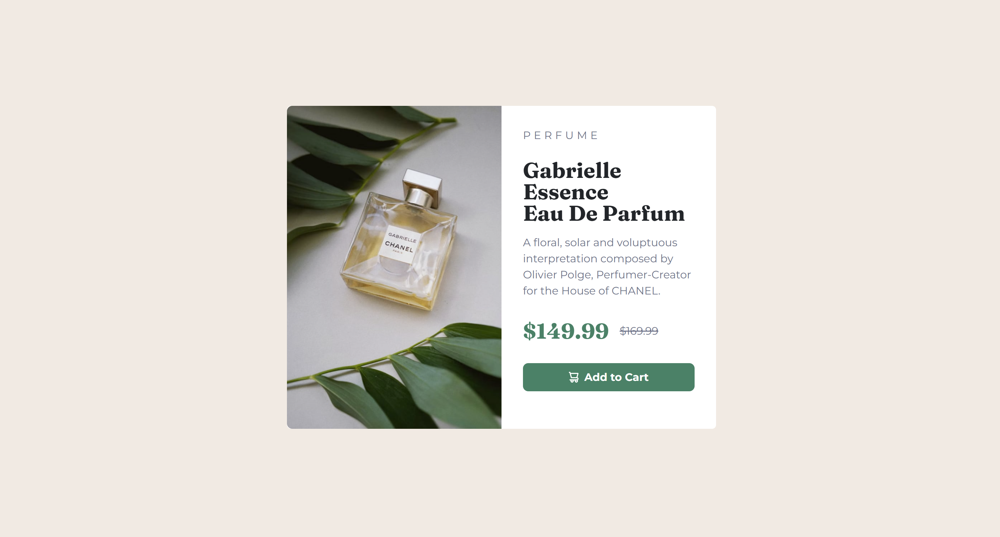

# Frontend Mentor - Product preview card component solution

This is a solution to the [Product preview card component challenge on Frontend Mentor](https://www.frontendmentor.io/challenges/product-preview-card-component-GO7UmttRfa). Frontend Mentor challenges help you improve your coding skills by building realistic projects. 

## Table of contents

- [Overview](#overview)
  - [The challenge](#the-challenge)
  - [Screenshot](#screenshot)
  - [Links](#links)
- [My process](#my-process)
  - [Built with](#built-with)
  - [What I learned](#what-i-learned)
  - [Continued development](#continued-development)
- [Author](#author)

## Overview

The goal of this challenge was to replicate the given Figma design using clean, semantic HTML and responsive CSS — in this case, reinterpreted with **Bootstrap 5 utilities** for layout and spacing.

### The challenge

Users should be able to:

- View the optimal layout depending on their device's screen size
- See hover and focus states for interactive elements

### Screenshot

### Links

- Solution URL: [Add solution URL here](https://your-solution-url.com)
- Live Site URL: [Add live site URL here](https://your-live-site-url.com)

## My process

I started by setting up a basic Bootstrap structure and defining a custom color palette in `:root` to match the Frontend Mentor design.

Then I divided the card into two main sections using the **Bootstrap grid system** (`row` + `col-md-6`):  
- the **left column** contains the `<picture>` element with responsive images,  
- the **right column** contains the content (`.card-body`) structured with Bootstrap utility classes for spacing and typography.

Afterward, I added a **custom button variant** (`.btn-accent`) using Bootstrap’s CSS variable system, allowing me to easily control hover and active states.

Finally, I adjusted border-radius and responsive behavior with a small custom media query.

### Built with

- Semantic **HTML5** markup  
- **Bootstrap 5.3.8** for grid, spacing, and utilities  
- **CSS custom properties** for color and theme consistency  
- **Mobile-first workflow**  
- **Responsive images** using `<picture>` and media queries  
- **Google Fonts** – *Fraunces* (titles) & *Montserrat* (body text)

### What I learned

This project helped me understand how Bootstrap’s utility-first approach can simplify layout creation, even for small static components.

To see how you can add code snippets, see below:

.btn-accent {
  --bs-btn-color: #fff;
  --bs-btn-bg: var(--clr-accent);
  --bs-btn-border-color: var(--clr-accent);
  --bs-btn-hover-bg: var(--clr-accent-hover);
  --bs-btn-active-bg: var(--clr-accent-hover);
  --bs-btn-focus-shadow-rgb: 13, 110, 253;
}

### Continued development

In future projects, I want to:

- Practice creating Bootstrap custom themes using SCSS variables
- Rebuild this same component using only Bootstrap utilities (zero custom CSS)
- Add dark mode using CSS custom properties
- Experiment with animation utilities for subtle hover effects

## Author

- Website: [Schima](https://schima.it/)
- Frontend Mentor: https://www.frontendmentor.io/profile/edoardozampini
- GitHub: (https://github.com/edoardozampini)
